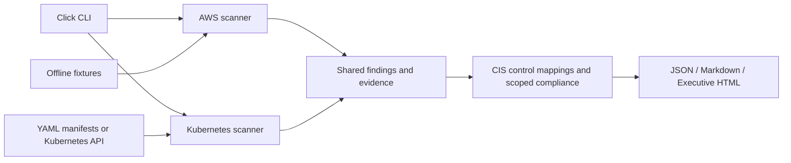

<p align="center">
  <a href="#requirements"></a>
  <a href="#checks-and-cis-mapping"></a>
  <a href="#architecture"></a>
  <a href="#checks-and-cis-mapping"></a>
  <a href="#reports-and-exit-codes"></a>
  <a href="LICENSE"></a>
  <a href="#docker"></a>
</p>

# Cloud Security Auditor

An extensible command-line Cloud & Kubernetes Security Posture Management (CSPM)
auditor. It checks AWS account configuration and Kubernetes manifests or live
workloads, maps applicable findings to CIS controls, and generates JSON,
Markdown, or executive HTML reports.

> CIS percentages are calculated only for the benchmark controls mapped to checks
> this tool actually evaluates. They are not a full benchmark certification or a
> substitute for a complete compliance assessment.

## Architecture



The scanners normalize results into typed findings, including stable rule IDs,
severity, evidence, CIS references, and actionable remediation. The report layer
uses the same result model for all formats. AWS demo mode and the test fixtures
run without cloud credentials or cluster access.

## Requirements

- Python 3.10 or newer
- AWS live scans: credentials available through the standard boto3 credential
  chain, plus read access to the APIs listed under [AWS permissions](#aws-permissions)
- Kubernetes cluster scans: a usable current kubeconfig context and permission
  to list Pods, Deployments, StatefulSets, DaemonSets, Jobs, and CronJobs

## Quickstart

Install the package, including development and test dependencies:

```console
python -m pip install -e ".[dev]"
```

Run the reproducible AWS demo (no credentials required):

```console
cloud-security-auditor audit aws --mock
cloud-security-auditor audit aws --mock --output reports/aws.html --fail-on high
```

Scan a directory of Kubernetes YAML files or a single manifest:

```console
cloud-security-auditor audit k8s --manifests ./samples/secure
cloud-security-auditor audit k8s --manifests ./deploy --output reports/k8s.md
```

Scan AWS using credentials in the boto3 credential chain. IAM and S3 are
account-wide; EC2 security groups and EBS volumes are scanned in the selected
region:

```console
cloud-security-auditor audit aws --region us-east-1 --output reports/aws.json
```

Scan workloads using the current kubeconfig context (or in-cluster service
account credentials when running inside a cluster):

```console
cloud-security-auditor audit k8s --cluster --output reports/cluster.html
```

Without `--output`, the CLI writes a JSON report to standard output. File report
format is inferred from `.json`, `.md`/`.markdown`, or `.html`. `--fail-on`
controls the exit status for CI: the default is `critical`; select `high`,
`medium`, `low`, or `never` to adjust the threshold. Collection errors are
reported and always cause a non-zero exit.

## Checks and CIS mapping

| Platform | Checks | CIS benchmark mapping |
|---|---|---|
| AWS | Public S3 ACLs/policies and incomplete Block Public Access; active root access keys and root console password without MFA; unrestricted IAM `Allow` policies on users, groups, and roles; public ingress to TCP 22/3389; unencrypted EBS volumes | AWS Foundations v1.5.0 controls 2.1.5, 1.1, 1.16, 5.2, 2.2.1 |
| Kubernetes | Privileged containers; root execution or missing `runAsNonRoot: true`; missing CPU/memory limits; sensitive `hostPath` mounts; dangerous added Linux capabilities | Kubernetes v1.8.0 controls 5.2.1, 5.2.6, 5.2.7, 5.2.8, 5.2.11. CPU/memory limits are additional best-practice checks and are not counted as a CIS control. |

The compliance percentage is the number of mapped controls without findings
divided by the mapped controls evaluated for that platform. A control is counted
once even when multiple resources fail it. Controls not mapped to implemented
checks are excluded from the denominator. Collection errors invalidate a
successful audit exit, so missing visibility is not presented as a pass.

Kubernetes manifest scans accept `.yaml` and `.yml` files, multi-document YAML,
Kubernetes `List` objects, Pods, and common Pod-template workloads. Sensitive
host paths include the host root, `/etc`, `/proc`, `/sys`, `/dev`,
`/var/run`, `/var/lib/docker`, and `/var/lib/kubelet`.

## AWS permissions

Use a dedicated read-only audit role and scope EC2 read calls to the intended
regions. The live collector uses IAM credential reports, user,
group, role, policy, S3 bucket/ACL/policy/public-access-block, and EC2 security
group/volume read APIs. For an initial least-privilege deployment, validate an
organization-specific policy against the API calls made by the installed
version; AWS managed `ReadOnlyAccess` is broader than necessary. Credential
report generation and retrieval require `iam:GenerateCredentialReport` and
`iam:GetCredentialReport`; the collector waits briefly for report generation
and fails explicitly if the root credential data is unavailable rather than
reporting a false pass.

The auditor never creates or modifies cloud resources. `--mock` reads only the
bundled fixture and does not initialize boto3.

## Reports and exit codes

- **JSON:** machine-readable findings, evidence, severity counts, collection
  errors, and scoped compliance summary.
- **Markdown:** concise findings table suitable for tickets and pull requests.
- **HTML:** self-contained executive report with responsive styling, severity
  ratings, findings, and a scoped compliance visualization.
- **Exit 0:** no findings at or above the selected threshold and no collection
  errors.
- **Exit 1:** threshold exceeded, invalid input/report format, or an audit
  collection error.

## Development and tests

```console
python -m pip install -e ".[dev]"
python -m pytest
```

Fixtures under `tests/fixtures/` exercise vulnerable and compliant AWS and
Kubernetes configurations. `samples/secure/` is a clean workload used by CI.

## Docker

Run the bundled clean Kubernetes manifest audit:

```console
docker compose run --rm audit
```

Or build the image and invoke another CLI command:

```console
docker build -t cloud-security-auditor .
docker run --rm cloud-security-auditor audit aws --mock --fail-on never
```

For live scans, mount credentials or a kubeconfig read-only and provide only
the required cloud or cluster access. Never bake credentials into the image.

## Continuous integration

The workflow in `.github/workflows/audit-ci.yml` installs the project, runs the
pytest suite, scans the clean Kubernetes sample with a high-severity CI gate, and
uploads a JSON report.
